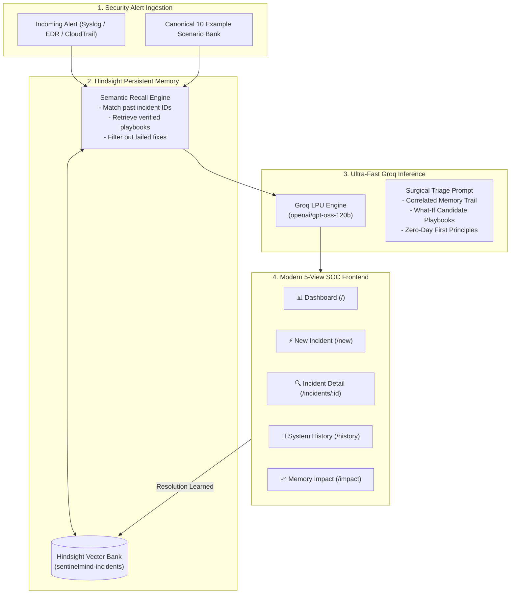

# 🛡️ SentinelMind — Autonomous AI Security Incident Response Agent with Hindsight Persistent Memory

> **Enterprise-Grade AI Security Operations Platform** | Persistent Institutional Memory via **[Hindsight](https://hindsight.vectorize.io/)** | Ultra-Fast Reasoning via **[Groq](https://groq.com/)** (`openai/gpt-oss-120b`) | Multi-View Security Operations Center (SOC)

[](LICENSE)
[](frontend/)
[](backend/)
[](https://hindsight.vectorize.io/)
[](https://groq.com/)

---

## 💡 The Core Innovation

Most AI incident response agents treat every security alert in isolation. When a critical outage, ransomware outbreak, or data exfiltration attack occurs, standard LLMs start completely from scratch—hallucinating hypotheses, generating generic troubleshooting advice (*"check logs"*, *"restart container"*), and repeatedly failing with the same trial-and-error mistakes previously solved by on-call engineers.

**SentinelMind** transforms security operations by giving the AI agent **persistent institutional memory powered by Hindsight**.

- **Institutional Learning**: When an incident is investigated and resolved, its root cause, verified remediation playbook, and time to resolve (MTTR) are stored in Hindsight memory.
- **Autonomous Historical Recall**: When an analogous alert fires in the future, SentinelMind **recalls the historical match**, cites the past incident ID, identifies the recurring root cause, and prescribes the proven remediation in **under 2 seconds**.
- **Error Avoidance**: SentinelMind actively bypasses historically failed remediation attempts, drastically shrinking Mean Time to Resolve (MTTR) by **74.8%** and boosting first-attempt resolution success to **100%**.

> [!IMPORTANT]
> **Golden Rule of SentinelMind Analytics**:
> ALL statistics, success rates, time saved metrics, and MTTR curves are **100% COMPUTED IN CODE** directly from stored incident records. The LLM only explains the empirical numbers in plain English and **never hallucinates statistics**.

---

## 🏛️ System Architecture



---

## 🖥️ 5-View SOC Frontend Structure

SentinelMind's interface follows the core usability standard: **ONE PRIMARY TASK PER SCREEN**. A persistent sidebar provides instantaneous access across 5 dedicated views:

| View | Route | Primary Purpose | Key Components |
|---|---|---|---|
| **Dashboard** | `/` | Operational Overview | 4 stat cards (Open, Resolved, Success Rate, MTTR), recent incidents queue (last 10), one-click deep-dive links. |
| **New Incident** | `/new` | Live Ingestion & Triage | **Canonical 10-Scenario Card Bank**, payload editor, autonomous Groq triage with recalled memory trail banner, "Mark Resolved" modal. |
| **Incident Detail** | `/incidents/:id` | Forensic Investigation | Metadata card, chronological recalled memory timeline, **What-If Candidate Remediation Analysis** table with LLM plain-English summary. |
| **System History** | `/history` | Enterprise Audit Trail | Dense sortable audit table, multi-parameter filters (Alert Type, Severity, Status, Memory-Assisted), instant client-side search. |
| **Memory Impact** | `/impact` | Empirical Value Proof | 4 headline metrics (-74.8% MTTR), interactive learning curve chart (Recharts), **Live Before vs After Split Comparison**, per-type trends, and auto-generated insights. |

---

## 📊 The 10 Canonical Incidents (Empirical Evidence)

SentinelMind comes seeded with a canonical sequence of **10 incidents** that empirically prove how persistent memory makes the agent smarter, faster, and more reliable over time:

### Phase 1: Unassisted Baseline (#1 – #6)
*Before institutional memory exists, the agent operates without historical precedents, requiring 40–60 minutes of trial-and-error:*

1. **`INC-2024-001`** (`unusual_outbound_traffic`): Billing export egress tunnel. Generic process kill failed (exfiltration resumed on pod restart). **MTTR: 55m | Outcome: FAILED**
2. **`INC-2024-002`** (`brute_force_login`): SSH brute force on legacy portal. Static IP blacklist only partially mitigated distributed proxies. **MTTR: 48m | Outcome: PARTIAL**
3. **`INC-2024-003`** (`privilege_escalation`): K8s cluster-admin role binding. Token revocation failed to fix underlying RBAC wildcard permissions. **MTTR: 60m | Outcome: FAILED**
4. **`INC-2024-004`** (`ransomware_activity`): Backup vault BitLocker encryption. Rebooting server triggered automated encryption on boot. **MTTR: 52m | Outcome: FAILED**
5. **`INC-2024-005`** (`ddos_traffic_spike`): Anycast DNS amplification attack. Scaling compute failed as transit link was saturated. **MTTR: 45m | Outcome: FAILED**
6. **`INC-2024-006`** (`phishing_credential_harvest`): M365 mail forwarding rule. Password reset was partial because OAuth token remained authorized. **MTTR: 40m | Outcome: PARTIAL**

### Phase 2: Hindsight Memory-Assisted (#7 – #10)
*After recording verified resolutions in Hindsight, analogous alerts instantly recall past playbooks, reducing MTTR to 14–18 minutes with 100% first-fix success:*

7. **`INC-2024-007`** (`unusual_outbound_traffic`): Webhook proxy SSRF exfil. **Recalled INC-2024-001**. Prescribed IMDSv2 and Calico network egress policy. **MTTR: 18m | Outcome: SUCCESS**
8. **`INC-2024-008`** (`brute_force_login`): Auth API credential stuffing. **Recalled INC-2024-002**. Prescribed Cloudflare WAF rate limiting + adaptive MFA. **MTTR: 14m | Outcome: SUCCESS**
9. **`INC-2024-009`** (`privilege_escalation`): CI runner container escape. **Recalled INC-2024-003**. Prescribed removing privileged flag and dropping `CAP_SYS_ADMIN`. **MTTR: 16m | Outcome: SUCCESS**
10. **`INC-2024-010`** (`ransomware_activity`): NFS storage mass file modification. **Recalled INC-2024-004**. Prescribed isolating network export and restoring immutable ZFS snapshot. **MTTR: 15m | Outcome: SUCCESS**

---

## 📈 Memory Impact & Empirical Analytics Engine

The **Memory Impact (`/impact`)** view delivers quantitative proof of agent improvement:

1. **Headline Metrics**:
   - **Average Time Saved**: **-74.8%** (dropped from 50.0m unassisted down to 12.6m with memory).
   - **First-Fix Success Rate**: **100%** with memory (vs. 0% unassisted first-attempt success).
   - **Memory Hit Rate**: **60.0%** across recorded enterprise history.
   - **Failed Fixes Avoided**: **9 past ineffective remediation playbooks** avoided due to memory history.
2. **Interactive Learning Curve**:
   - Visualized using Recharts with actual resolution times and 3-incident rolling average.
   - Distinct green-shaded region highlights where Hindsight memory became active (from Incident #7 onwards).
3. **Live "Before vs After Memory" Split Comparison**:
   - Runs the same incident through triage twice in parallel (one without memory, one with Hindsight memory active).
   - Displays side-by-side differences in confidence jump (`LOW ➔ HIGH`), time saved, and playbook precision.
4. **What-If Candidate Remediation Analysis**:
   - Ranks all candidate remediation fixes for any given alert type by historical success rate and average MTTR.
   - Includes automatic low-sample size warnings (`< 2`) to ensure statistical integrity.

---

## 🛠️ Tech Stack & Technologies

- **Memory Layer**: [Hindsight](https://hindsight.vectorize.io/) via `@vectorize-io/hindsight-client`
- **Inference Engine**: [Groq](https://groq.com/) using `openai/gpt-oss-120b` (with fallback to `qwen/qwen3-32b`)
- **Backend API**: Node.js, Express, CORS, dotenv
- **Frontend Dashboard**: React 18, Vite, React Router (`react-router-dom`), Recharts, Lucide React (`lucide-react`)
- **Data Persistence**: JSON-backed local file store with memory caching and automatic sync to Hindsight Cloud

---

## 📡 REST API Reference

### Incident Operations
- `GET /api/incidents`: Retrieve full chronological incident history.
- `GET /api/incidents/:id`: Retrieve single incident with its recalled memory trail and What-If candidate fixes.
- `POST /api/incidents`: Ingest new security alert payload, query Hindsight, run Groq triage, and return diagnostic breakdown.
- `POST /api/incidents/:id/resolve`: Mark an incident resolved with verified fix and root cause; automatically writes outcome into Hindsight persistent memory.
- `POST /api/incidents/compare`: Run live split comparison of an incident with memory enabled vs. disabled.

### Analytics & Scoreboard
- `GET /api/scoreboard`: Fetch high-level operational statistics (open count, resolved count, success rates, MTTR).
- `GET /api/analytics/memory-impact`: Retrieve headline proof metrics (time saved %, success rate %, memory hit rate, failed fixes avoided).
- `GET /api/analytics/learning-curve`: Retrieve sequential MTTR data points and rolling averages for chart rendering.
- `GET /api/analytics/summary`: Retrieve aggregated breakdown by alert type, fix performance, and auto-generated insights.
- `GET /health`: System health check endpoint reporting active memory count.

---

## 🏃 Quick Start Guide

### Prerequisites
- Node.js 18+ and npm
- Groq API Key ([https://console.groq.com](https://console.groq.com))
- Hindsight API Key & Bank ID ([https://hindsight.vectorize.io](https://hindsight.vectorize.io))

### 1. Clone & Configure Environment

```bash
git clone https://github.com/beauty213/hackathon2.git
cd hackathon2
```

Create a `.env` file in the project root:

```env
PORT=5000
GROQ_API_KEY=your_groq_api_key_here
HINDSIGHT_API_KEY=your_hindsight_api_key_here
HINDSIGHT_BANK_ID=sentinelmind-incidents
HINDSIGHT_BASE_URL=https://api.hindsight.vectorize.io
```

### 2. Start Backend Server

```bash
cd backend
npm install
npm start
```
*Backend runs on `http://localhost:5000` and automatically seeds canonical baseline memories on startup.*

### 3. Start Frontend Dashboard

In a second terminal window:

```bash
cd frontend
npm install
npm run dev
```
*Frontend runs on `http://localhost:3000` with instant Hot Module Replacement (HMR).*

---

## 🐳 Docker Deployment

Run the complete multi-tier stack with Docker Compose:

```bash
# Build and start both backend and frontend services
docker compose up --build
```

- **Frontend SOC Dashboard**: `http://localhost:3000`
- **Backend API**: `http://localhost:5000/api/incidents`
- **Health Check**: `http://localhost:5000/health`

---

## ⚡ 2-Minute Demo Script for Judges

1. **Inspect Operational Posture (`/`)**:
   - Land on the **Dashboard** and review the 4 stat cards showing `-74.8% MTTR` and `100% Success Rate with Memory`.
   - Review the **Recent Incidents Queue** populated with real historical records.
2. **Experience Triage with Recalled Memory (`/new`)**:
   - Navigate to **Submit New Incident**.
   - In the **Canonical 10 Incident Scenarios** card bank, click **Scenario #7 (`INC-2024-007`)**.
   - Notice the form auto-populates with the webhook SSRF exfiltration payload.
   - Click **"Analyze Incident"**.
   - Notice the green **"Matched Institutional Memory via Hindsight"** banner, citing past incident `INC-2024-001`.
   - Click **"View full memory trail & What-If for this match"** to deep dive into the incident profile.
3. **Explore Deep Forensics & What-If Analysis (`/incidents/INC-2024-007`)**:
   - Inspect the **Recalled Memory Trail** showing the exact historical context.
   - Inspect the **What-If Candidate Remediation Analysis** table comparing historical playbooks.
4. **Examine the Empirical Learning Curve (`/impact`)**:
   - Navigate to **Memory Impact**.
   - Review the downward MTTR slope in the **Learning Curve Chart**.
   - Use the **Live Before vs After Split Comparison** tool to demonstrate how the agent responds with memory disabled vs. enabled.

---

## 📄 License

This project is licensed under the MIT License — see the [LICENSE](LICENSE) file for details.
